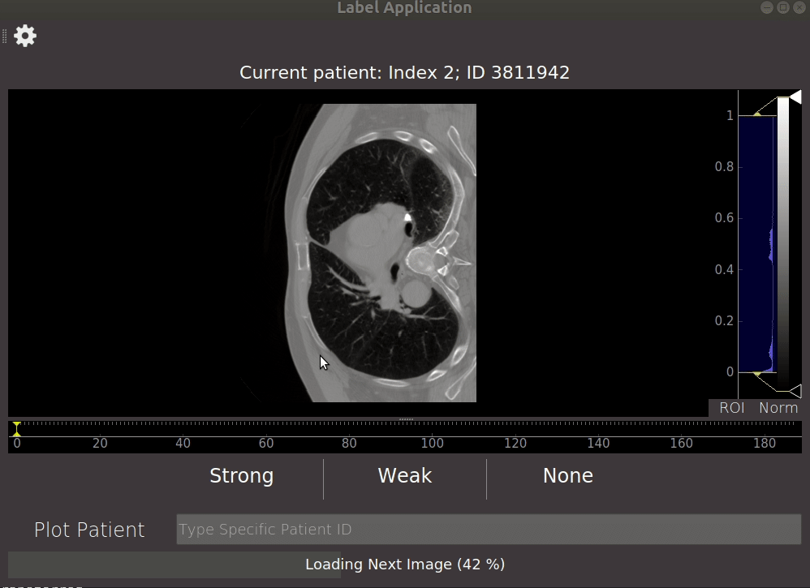

# ALTAR - Artifact Labelling Tool for Artifact Reduction
A cross-platform desktop application written in PyQt to help researchers manually and efficiently annotate large healthcare imaging datasets.

The application runs locally and securely connects to a remote server to access and plot one image at a time. The user can look through the 3D image and label various quantities, such as the presence of metal dental artifacts. The app loads the subsequent image while you label, so that the next image is immediately available.

## Getting Started
### Installation
1. If you do not already have Python 3.7 and the conda package manager, install them [here](https://docs.conda.io/en/latest/miniconda.html).
2. Download or clone the app repository.
```
$ git clone https://github.com/CArrowsm/label_artifacts.git
```

3. Create and activate a new conda environment for the app.
```
$ conda env create -f environment.yml
```

### App setup
The `settings.json` file contains all settings used by the app. These include the host and port of the server, and paths to remote files. In particular, you may need to change `"Remote CSV Path"` and `"Remote Image Path"`.

The app assumes that the images you want to label are listed in a CSV (found at `"Remote CSV Path"`) with columns
```
index   patient_id    has_artifact   a_slice
```
where `index` is an integer ordering each patient and `patient_id` is a unique number for each patient which appears in that patient's image file name. `has_artifact` is the DA status (2=strong, 1=weak, 0=none) and `a_slice` is the axial slice index you want to label for each patient.

The app will access all images from `"Remote Image Path"` and assumes each image to be an NPY file named `patientID_img.npy`. Changing any of these assumptions is fairly straight-forward and can be found in `app/label.py`.


## Usage
To start the app, navigate to the application directory on the command line, activate the environment, and run main.py:
```
$ cd path/to/ALTAR
$ conda activate label-app
$ python main.py
```

### Login
Upon starting the app, you will be presented with a sign-in page to the host found in `settings.json`. Enter your username and password and click "Login". Note: The page may freeze briefly after you click login. This is expected behaviour as it sometimes takes time for the first image to load.

### Labelling Images
Once you have successfully logged in, you will be presented with a 3D image of the first patient which you can scroll through. Next:
1. Scroll to the slice you want to label as "stronges DA" "central mouth".
2. Click the button corresponding to the DA class you want to label this patient. This immediately saves your annotation and displays the next image.
3. The app will download the next image into memory while you label an image. This way you don't have to wait for each image to load consecutively.
4. You can display a specific image by typing the patient ID into the text field and clicking "Plot Patient". The app will then carry on loading images from that patient's index.


Have a look at this example!



### Editing Settings
Settings can be changed anytime (either from login page or from label page) by clicking on the icon in the top-left corner of the app window. Simply change the text in the fields and click save.


## Warnings
1. The app uses multithreading to load one image in the background while you label another. When logging-in and when plotting a specific patient (by clicking "Plot Patient") the app only uses one thread and the GUI therefore freezes until the image is loaded. The app can crash if buttons are pressed during this process. This will be fixed in later releases.

2. Closing the application while an image is loading (in the background or otherwise) may cause the app to crash without saving.

3. The app should be closed from the GUI, by clicking "x", rather than with a keyboard interrupt from the command line.
